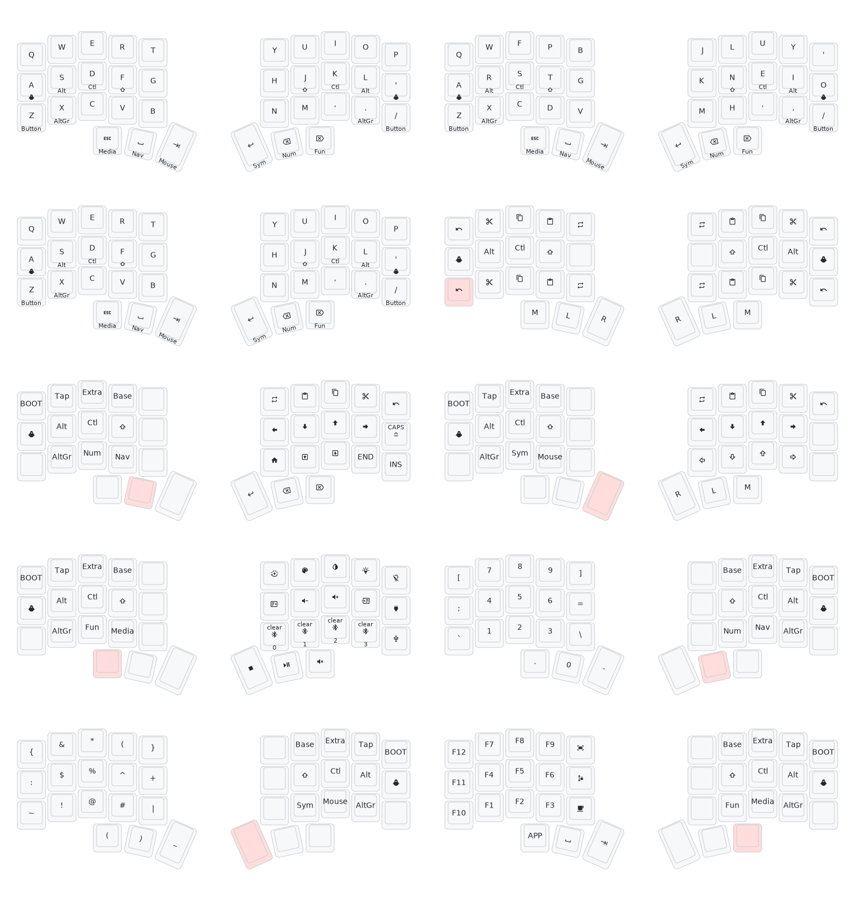

# My custom keyboard layout

To edit the layout interactivly use nickcoutsos' keymap-editor [link](https://nickcoutsos.github.io/keymap-editor/)

The layout was generated using caksoylar's keymap-drawer [link](https://github.com/caksoylar/keymap-drawer/tree/main)

The keymap is based on Miryoku [link](https://github.com/manna-harbour/miryoku/tree/master/docs/reference)
